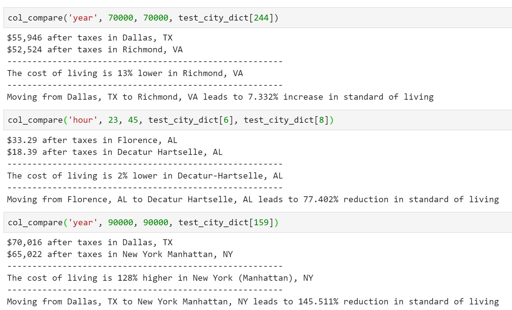

# ShouldURelocate
Calculates change in standard of living given relocation and compensation 

-> Uses [this link](https://neuvoo.com/tax-calculator/?iam=&salary=%s&from=%s&region=%s) to calculate compensation after taxes
-> Scraped all the cities from [this link](https://www.nerdwallet.com/cost-of-living-calculator) so the query parameters in the url could be changed easily
-> Given the city, uses [this link again](https://www.nerdwallet.com/cost-of-living-calculator) get cost of living
-> With tax deductions and cost of living (assume that is the biggest cost), we can figure out how much impact the relocation would have

